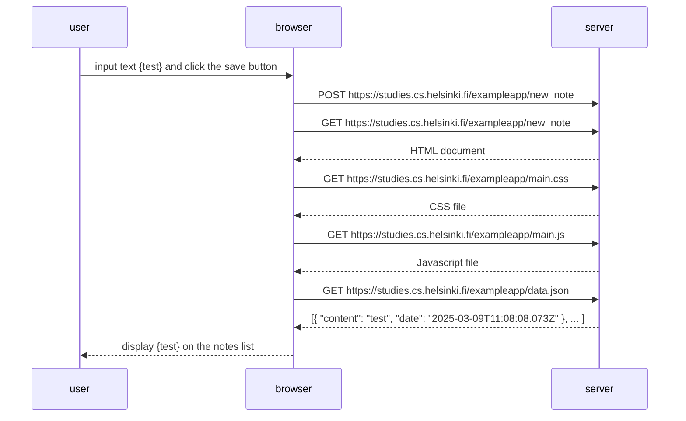

```mermaid
sequenceDiagram
  participant user
  participant browser
  participant server

  user ->> browser: input text {test} and click the save button
  browser ->> server: POST https://studies.cs.helsinki.fi/exampleapp/new_note
  browser ->> server: GET https://studies.cs.helsinki.fi/exampleapp/new_note
  server-->>browser: HTML document

  browser ->> server: GET https://studies.cs.helsinki.fi/exampleapp/main.css
  server-->>browser: CSS file
  
  browser ->>server: GET https://studies.cs.helsinki.fi/exampleapp/main.js
  server-->>browser: Javascript file

  browser->>server: GET https://studies.cs.helsinki.fi/exampleapp/data.json
  server-->>browser: [{ "content": "test", "date": "2025-03-09T11:08:08.073Z" }, ... ]
  browser-->>user: display {test} on the notes list
```
