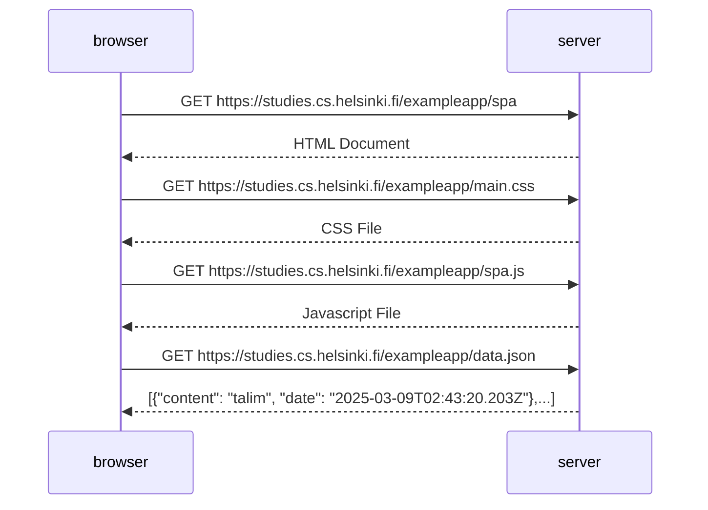

```mermaid
sequenceDiagram
  participant browser
  participant server

  browser ->> server: GET https://studies.cs.helsinki.fi/exampleapp/spa
  server -->> browser: HTML Document
  browser ->> server: GET https://studies.cs.helsinki.fi/exampleapp/main.css
  server -->> browser: CSS File
  browser ->> server: GET https://studies.cs.helsinki.fi/exampleapp/spa.js
  server -->> browser: Javascript File
  browser ->> server: GET https://studies.cs.helsinki.fi/exampleapp/data.json
  server -->> browser: [{"content": "talim", "date": "2025-03-09T02:43:20.203Z"},...]
```
