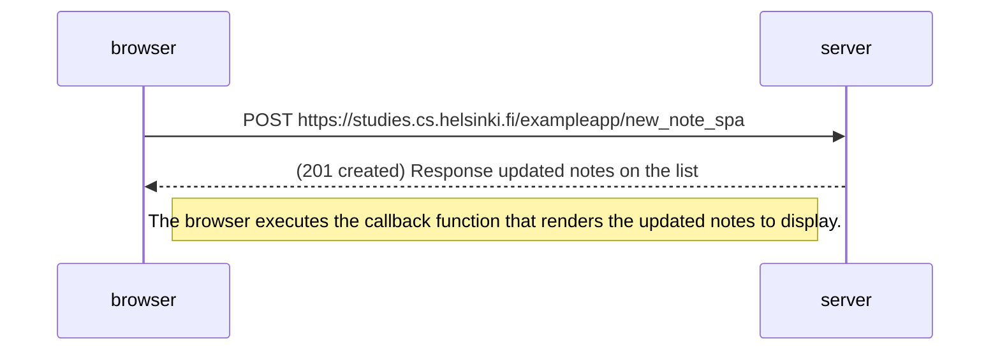

```mermaid
  sequenceDiagram
    participant browser
    participant server

    browser ->> server: POST https://studies.cs.helsinki.fi/exampleapp/new_note_spa
    server -->> browser: (201 created) Response updated notes on the list
    Note right of browser: The browser executes the callback function that renders the updated notes to display.
```
